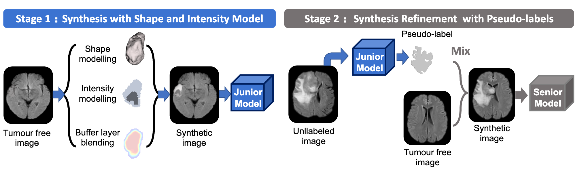
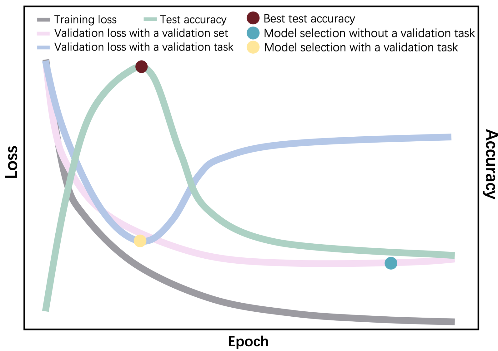

# SynthTumour: Unsupervised Brain MRI Tumour Segmentation via Two-Stage Image Synthesis

Please also cite this paper if you are using SynthTunour for your research! For more information about SynthTumour, please read the following [paper](https://arxiv.org/abs/2304.01472), # 

🚧🚧🚧  Paper link update in progress🚧🚧🚧 

```
@article{zhang2025unsupervised,
author    = {Xinru Zhang and Ni Ou and Chenghao Liu and Zhizheng Zhuang and Paul M. Matthews and Yaou Liu and Chuyang Ye and Wenjia Bai},
title     = {Unsupervised Brain MRI Tumour Segmentation via Two-Stage Image Synthesis},
journal   = {Medical Image Analysis},
year      = {2025},
month     = {March},
day       = {17}
}
```

Figure 1 provides an overview of the method proposed in this study. Overview of SynthTumour, an unsupervised brain MRI tumour segmentation method with a two-stage synthesis strategy. In the first stage, empirical shape and intensity models are applied to generate synthetic images for junior model training. In the second stage, unlabelled brain tumour images are used, mixed with pseudo-labels from the junior model to synthesise images with realistic tumour shapes and textures for senior model training.



Our work drew inspiration from the amazing fepegar's [resector](https://github.com/fepegar/resector) tool, which served as the main basis for generating the 3D tumor-like shape. We made certain revisions to the tool to suit our specific needs.
# Installation
```
conda create --name SynthTumour python=3.7.7
conda activate SynthTumour
pip install light-the-torch
ltt install torch
pip install git+https://github.com/fepegar/resector
git clone https://github.com/ZhangxinruBIT/SynthTumour.git
```

# Usage for Generation
**Run demo**
```
cd SynthTumour
python resect-multi-tumor.py  DemoData/OAS30003_MR_d1631/flair.nii.gz test_img.nii.gz test_lab.nii.gz

```

To utilize multiprocessing for generating images and their corresponding labels, we need to organize the data in the following structure: 


**Data Structure**


     DemoData
      ├── OAS31157_MR_d4924
      │   ├── flair_brainmask.nii.gz
      │   └── flair.nii.gz
      ├── OAS31158_MR_d2481
      │   ├── flair_brainmask.nii.gz
      │   └── flair.nii.gz
      ├── ...
      │    
      ├── ...
      │   
      ├── OAS31167_MR_d2053
      │   ├── flair_brainmask.nii.gz
      │   └── flair.nii.gz
      ├── ...
    
# Run with multiprocessing for tumour generation in Stage 1
```
cd SynthTumour
python Prompt-multi-tumor.py

```

After that we could get the generated folds as below:

     .
     └── Task100_OASIS-PLBTS
         ├── imagesTr
         │   ├── OAS30003_MR_d1631_0000.nii.gz
         │   ├── OAS30135_MR_d2931val_0000.nii.gz
         │   └── OAS30137_MR_d3165_0000.nii.gz
         └── labelsTr
             ├── OAS30003_MR_d1631.nii.gz
             ├── OAS30135_MR_d2931val.nii.gz
             └── OAS30137_MR_d3165.nii.gz
Then you can train a junior model.

**Usage for Segmentation with [nnU-Net](https://github.com/MIC-DKFZ/nnUNet.git)**

The "val" marker is used to differentiate between data for training and validation. This marker can also be used for data splitting in [nnU-Net](https://github.com/MIC-DKFZ/nnUNet.git). Specifically, in **nnunet.training.net work_training.nnUNetTrainerV2.do_split()**.

We did not focus on imitating the tumor texture, as establishing the accurate tumor texture from MRI images is challenging. Instead, we proposed a validation task to prevent the model from overfitting, ensuring better results.

Figure 2 illustrates the importance of the validation task in preventing overfitting caused by manual texture on MRI. It presents a schematic of the training process of the prompt model. Without the validation task, model selection may occur after the turning point of test accuracy, leading to overfitting, even if a validation set comprising synthetic data is separated from the training set. However, with the inclusion of the validation task, the turning point can be better identified for effective model selection.
<div align=center></div>

# Run with multiprocessing for tumour generation in Stage 2
After you train a junior model, you can obtain the pseudo with the junior model, and utilised for the generation in the Stage 2.

```
cd SynthTumour
python Stage2_mixed_with_pseudo_label.py --mask_check_path XXXX --imagesTr_path XXXX --labelsTr_path XXXX --healthyimgTr XXXX 
```
--mask_check_path: Path to save csv file

--imagesTr_path: Path to raw tumour images with nnU-Net like data structure

--labelsTr_path: Path to raw pseudo-labels generated by the junior model with nnU-Net like data structure

--healthyimgTr:Path to raw healthy images, like tumour-free images also with nnU-Net like data structure

Next, you can train a senior model using nnU-Net! Make sure to combine the mixed data (imagesTrMix and labelsMix) with the original data and the pseudo-labels (imagesTr and labelsTr) for training.


